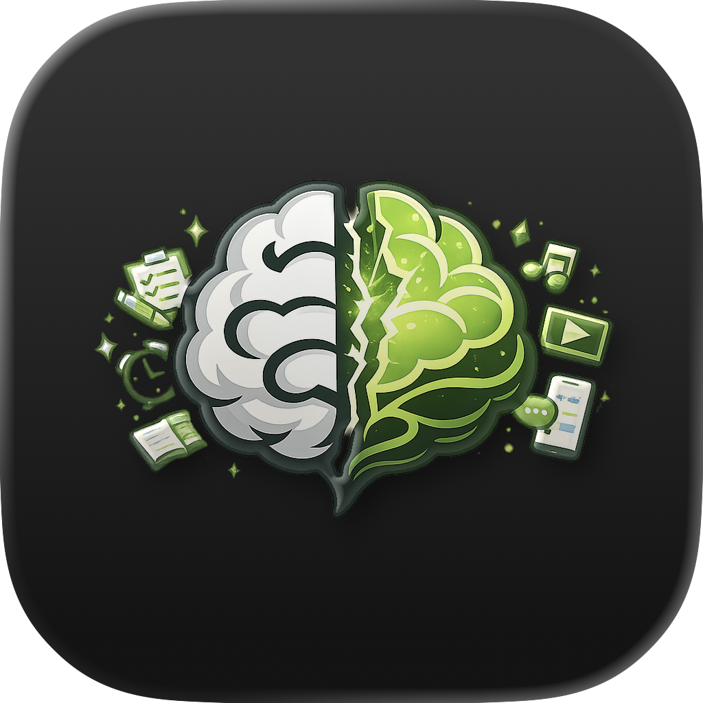
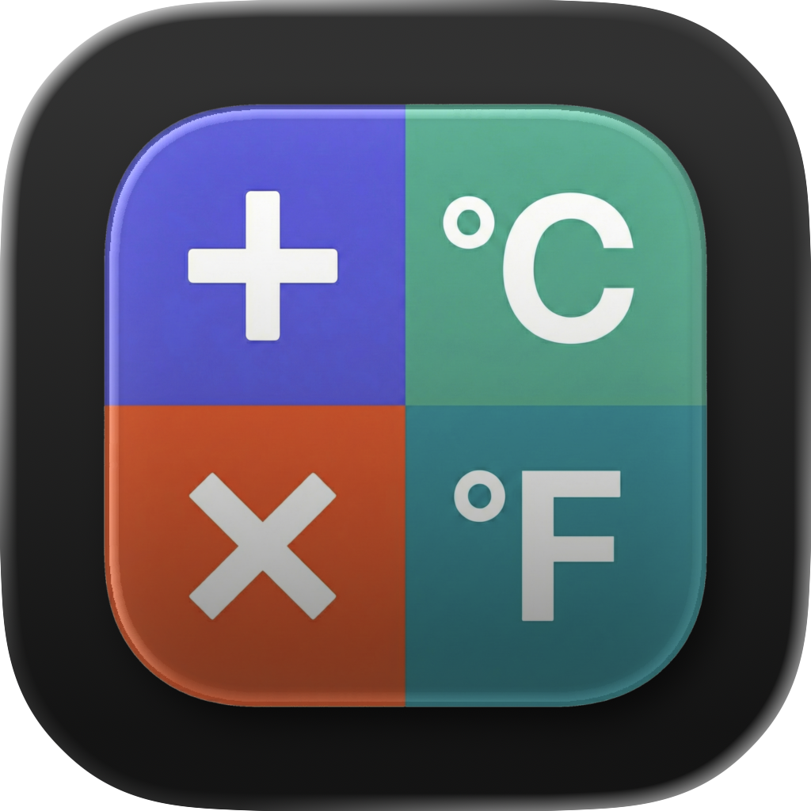
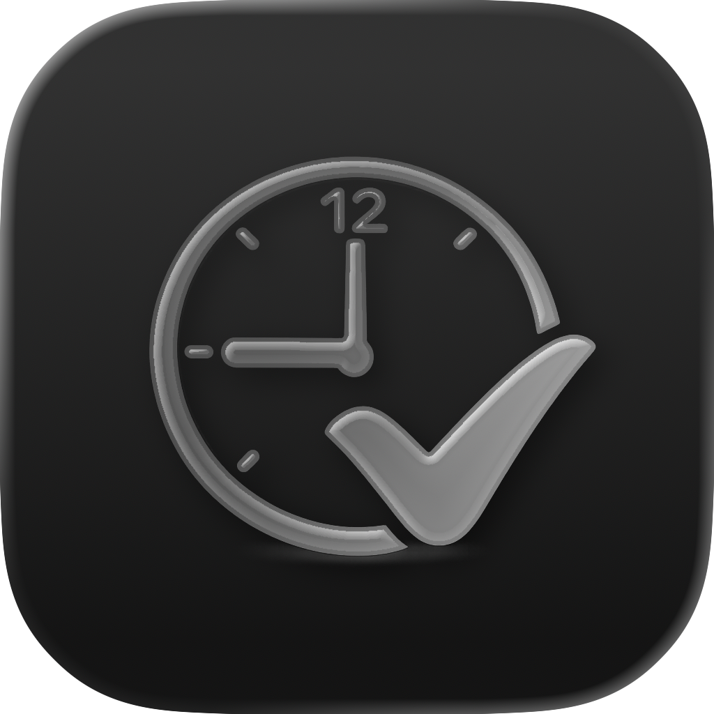

<h1>👋 Hi, I'm Alex Ryan</h1>

  iOS developer building focused, practical apps with SwiftUI.
  I turn everyday frustrations into simple, well-designed products that help people save time,
  stay organized, and build better habits.

  🔗 <strong>Portfolio:</strong>
  <a href="https://alx-ryan.github.io/">https://alx-ryan.github.io/</a>

<h2>📱 Apps</h2>

<h3>
  
  Focus First
</h3>

  A productivity app that helps users reduce distracting screen time by earning app access
  through focused work.

<ul>
  <li>App blocking with Screen Time APIs</li>
  <li>Focus timer and productivity tracking</li>
  <li>Reward-based unlock system</li>
  <li>Built with Family Controls, Device Activity, Managed Settings, and SwiftUI</li>
</ul>

<h3>
  
  ConvertCalc
</h3>

  A calculator and unit converter designed to be fast, customizable, and enjoyable to use.

<ul>
  <li>Calculator and unit conversion tools</li>
  <li>Custom themes and personalization</li>
  <li>Clean, modern SwiftUI interface</li>
  <li>Lightweight and privacy-friendly</li>
</ul>

<h3>
  
  Hours Tracker
</h3>

  A straightforward work log for tracking hours, mileage, earnings, and job notes.

<ul>
  <li>Shift and work-hour tracking</li>
  <li>Mileage logging</li>
  <li>Reporting and summaries</li>
  <li>iCloud sync</li>
</ul>

<h3>
  
  Poopy
</h3>

  A privacy-focused bowel movement tracker designed to help users better understand digestive health trends.

<ul>
  <li>Fast daily logging</li>
  <li>Trend analysis</li>
  <li>Optional Apple Health integration</li>
  <li>Local-first data storage</li>
</ul>

  📲 App Store links, screenshots, privacy policies, and support information:
   
  <a href="https://alx-ryan.github.io/">https://alx-ryan.github.io/</a>

<h2>🛠 Tech Stack</h2>

<ul>
  <li>Swift</li>
  <li>SwiftUI</li>
  <li>MVVM Architecture</li>
  <li>Swift Concurrency</li>
  <li>Core Data</li>
  <li>CloudKit / iCloud Sync</li>
  <li>Family Controls</li>
  <li>Device Activity</li>
  <li>Managed Settings</li>
  <li>StoreKit</li>
  <li>Git & GitHub</li>
  <li>App Store Connect</li>
</ul>

<h2>🎯 Current Focus</h2>

<ul>
  <li>Building sustainable consumer iOS apps</li>
  <li>Improving onboarding and retention</li>
  <li>App Store Optimization</li>
  <li>Subscription-based products</li>
  <li>Productivity and habit-building tools</li>
</ul>

<h2>🌍 About Me</h2>

<ul>
  <li>Based in Osaka, Japan 🇯🇵</li>
  <li>Studying Japanese</li>
  <li>Building and shipping independent iOS apps</li>
  <li>Interested in productivity, learning, health, and utility software</li>
</ul>
